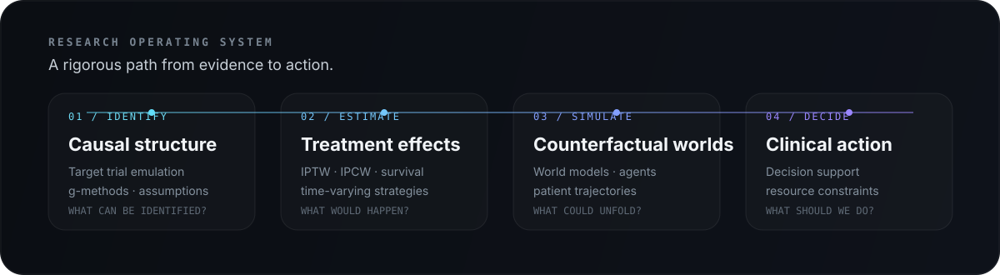

<p align="center">
  
</p>

<p align="center">
  <a href="https://www.linkedin.com/in/romainli/"><b>LinkedIn</b></a>
  &nbsp;·&nbsp;
  <a href="#research"><b>Research</b></a>
  &nbsp;·&nbsp;
  <a href="#methods--tools"><b>Methods</b></a>
  &nbsp;·&nbsp;
  <a href="#currently-exploring"><b>Now</b></a>
</p>

---

## About

I'm **Romain Li**, a researcher working at the intersection of **causal inference, machine learning, and clinical decision-making**.

Currently at **Harvard Medical School** in the MMSc in Global Health Delivery program. I previously trained at **Northwestern Medicine**, where my work focused on causal inference with longitudinal real-world clinical data.

My central question is simple:

> **Can healthcare AI move beyond predicting what will happen — and reason about what would happen under different decisions?**

I am especially interested in building models that connect **causal identification**, **counterfactual estimation**, **world modeling**, and **decision support**.

<br>

<p align="center">
  
</p>

---

## Research

<table>
<tr>
<td width="50%" valign="top">

### 🧠 Counterfactual World Models

Exploring how causal inference and learned world models can be combined for **clinical decision support**, especially when treatments, resources, and patient trajectories evolve over time.

**Current direction**

- Counterfactual reasoning
- Sequential decision-making
- Agent-based simulation
- Causal representation learning
- Resource-constrained healthcare

</td>
<td width="50%" valign="top">

### 🧬 Real-World Oncology

Using observational clinical data to emulate treatment strategies and estimate causal effects in oncology.

**Methods I work with**

- Target trial emulation
- Cloning + artificial censoring
- IPTW / IPCW
- Pooled logistic models
- Survival analysis
- Time-varying treatment strategies

</td>
</tr>
</table>

### Current thesis direction

**Counterfactual Reasoning and Causal World Models for Clinical Decision Support in Resource-Limited Cancer Care**

The goal is to connect rigorous causal estimation with a simulation / decision layer that can compare clinically meaningful treatment alternatives under real-world constraints.

---

## Methods & Tools

```text
CAUSAL INFERENCE      Target Trial Emulation · g-methods · IPTW · IPCW
STATISTICS            Survival Analysis · Longitudinal Models · Bootstrap
MODELING              Pooled Logistic Models · Counterfactual Prediction
AI                    PyTorch · Representation Learning · Agent Simulation
PROGRAMMING           R · Python · SAS · Git
DOMAINS                Oncology · EHR / Real-World Data · Global Health
```

---

## Currently Exploring


A few questions I keep coming back to:

- How should **causal structure** be preserved inside learned world models?
- Can **target trial emulation** provide the empirical foundation for counterfactual simulators?
- When should we use a **Markov model**, an **agent-based model**, or a learned generative model?
- How can AI support decisions without hiding **confounding, assumptions, and uncertainty**?

---

## Selected Interests

<p align="center">
  <code>Causal Inference</code>&nbsp;&nbsp;
  <code>Target Trial Emulation</code>&nbsp;&nbsp;
  <code>World Models</code>&nbsp;&nbsp;
  <code>Counterfactual Reasoning</code>&nbsp;&nbsp;
  <code>Healthcare AI</code>&nbsp;&nbsp;
  <code>Oncology</code>
</p>

<br>

<p align="center">
  <b>Researcher × Builder</b><br>
  <sub>Building systems that reason about interventions, counterfactuals, and decisions.</sub>
</p>
